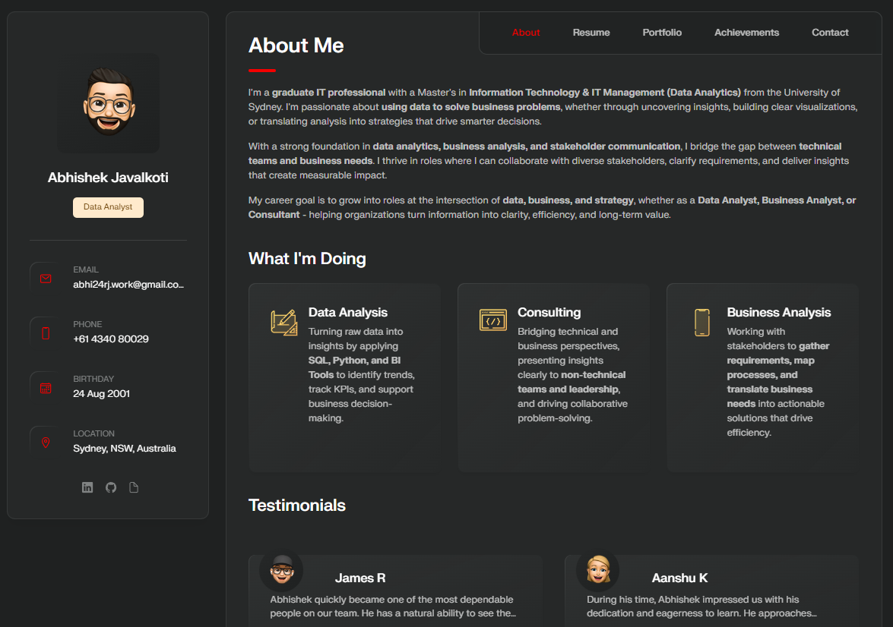

# Personal portfolio

This portfolio showcases my experience, projects, skills, and education. Built with a minimalist, user-focused design and fully responsive for 
every device, it’s a one-stop solution for anyone interested in my background or work style.

## Demo

## Features

- Fully responsive design, works seamlessly on all devices.
- Clean, minimalist layout for a professional presentation.
- Easy to customize with clear code structure.
- SEO optimized
- Simple, yet modern, design focused on user experience.

## Hosting
  This portfolio is hosted using GitHub Pages:
  Public at abhishek24j.github.io/personal-portfolio

## Technologies Used

- HTML5
- CSS3
- JavaScript

## Connect With Me!

If you want to contact me you can reach me at
- [LinkedIn](https://www.linkedin.com/in/abhishekjavalkoti/).
- [Mail](mailto:abhi24rj.work@gmail.com).
